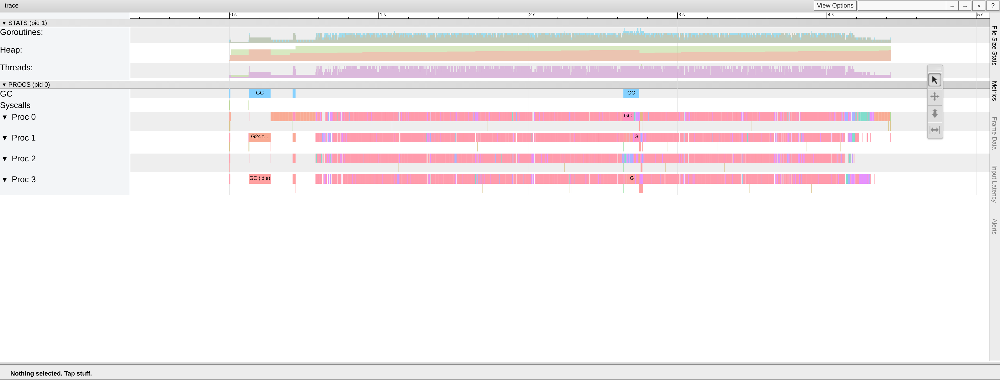
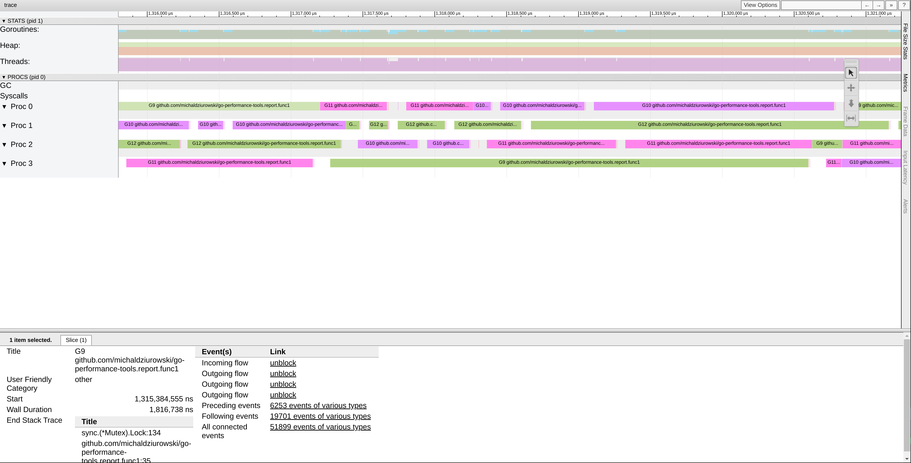
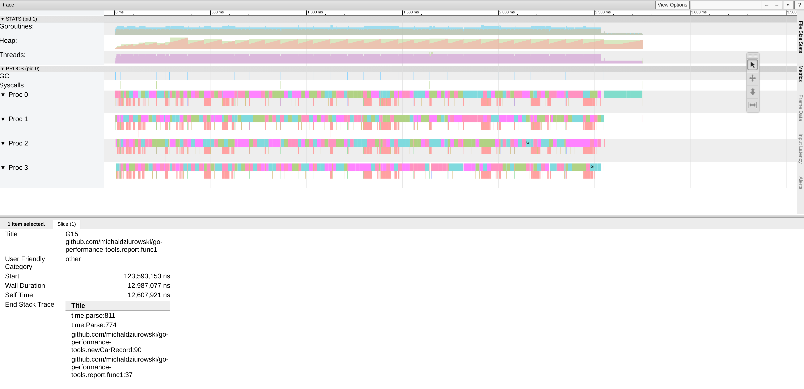
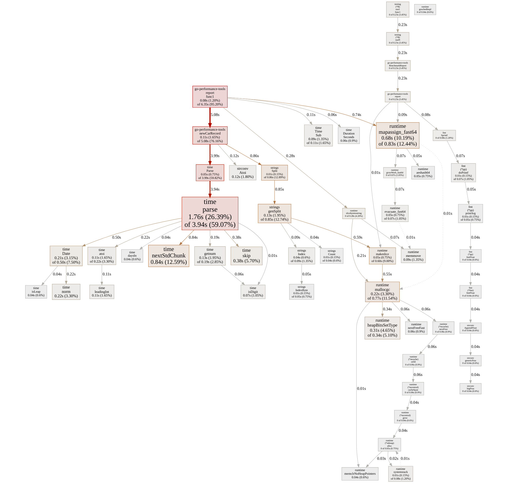
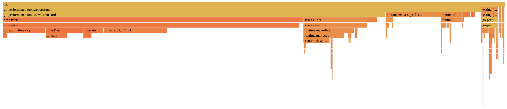

Some time ago I read a great series of blog posts about [making code faster](https://ayende.com/blog/176034/making-code-faster-the-interview-question), the problem described there is easy to understand and the results of performance optimizations are quite impressive. I decided that this example would be a great base for my adventure in the exploration of tools for performance analysis in go, so if you are also interested tag along :)

### The problem

The problem, as I mentioned, is quite simple. Given a text file of parking lot entries calculate how much time each car spent in it.
The file consist of lines (delimited by CRLF) and each line has three columns: time of entry, time of leave and car id.

```
2015-01-01T16:44:31 2015-01-01T19:09:14 00043064
2015-01-01T04:20:01 2015-01-01T05:04:50 00192676
2015-01-01T09:07:08 2015-01-01T10:32:53 00165147
2015-01-01T00:43:35 2015-01-01T01:01:05 00184024
2015-01-01T20:31:41 2015-01-01T22:39:05 00098557
2015-01-01T14:01:02 2015-01-01T15:26:16 00019519
2015-01-01T10:56:23 2015-01-01T12:23:57 00112591
2015-01-01T11:55:57 2015-01-01T12:47:59 00052067
2015-01-01T01:31:48 2015-01-01T03:28:07 00181835
2015-01-01T10:12:43 2015-01-01T12:36:07 00135455
```

### Solution

The straight forward solution could look like this: 

```go
type carRecord struct {
	Start time.Time
	End   time.Time
	ID    int
}

func newCarRecord(line string) carRecord {
	parts := strings.Split(line, " ")

	start, _ := time.Parse("2006-01-02T15:04:05", parts[0])
	end, _ := time.Parse("2006-01-02T15:04:05", parts[1])
	id, _ := strconv.Atoi(parts[2])

	return carRecord{start, end, id}
}

func report(in, out string) {
	bytes, _ := ioutil.ReadFile(in)
	content := string(bytes)
	lines := strings.Split(content, "\r\n")

	durations := make(map[int]float64)

	for _, line := range lines {
		if line != "" {
			record := newCarRecord(line)
			duration := record.End.Sub(record.Start).Seconds()
			if _, ok := durations[record.ID]; ok {
				durations[record.ID] += duration
			} else {
				durations[record.ID] = duration
			}
		}
	}

	var sb strings.Builder
	for id, duration := range durations {
		sb.WriteString(fmt.Sprintf("%d %.0f\r\n", id, duration))
	}

	ioutil.WriteFile(out, []byte(sb.String()), 0644)
}
```

This code reads the whole file into memory, splits it by lines, parses each line, calculates duration for each car, sums it with previousely calculated ones and writes results to another file.

Execution of this program takes on my machine around 5.3s.

Fun fuct: try to replace string.Builder with string concatenation like this:

```go
output := ""
for id, duration := range durations {
	output += fmt.Sprintf("%d %.0f\r\n", id, duration)
}
```
and see what happens. Spoiler alert: it then takes around 50s to execute :D

### Tracing

Ok, ~5.3s is not that bad but since we know it can be faster it would be a sin not to try.
One of the things go is famous for is its support for concurrency so let's try that.
We will create workers responsible for calculations for a given batch of lines.

```go
func report(inFileName, outFileName string) {
	bytes, _ := ioutil.ReadFile(inFileName)
	content := string(bytes)
	lines := strings.Split(content, "\r\n")

	durations := make(map[int]float64)
	wg := sync.WaitGroup{}
	mu := sync.Mutex{}
	noOfWorkers := 4 // just arbitrary number of workers 
	cWork := make(chan []string, 100) // channel on which we will be sending batches for workers

	for i := 0; i < noOfWorkers; i++ {
		go func() { // worker code - receives a batch of lines, calculates the duration for car and sums it up with reviously calculated values
			for dataBatch := range cWork {
				for x := 0; x < len(dataBatch); x++ {
					line := dataBatch[x]
					record := newCarRecord(line)
					duration := record.End.Sub(record.Start).Seconds()
					mu.Lock() // we have to lock modifications on shared map
					durations[record.ID] += duration
					mu.Unlock()
				}
			}

			wg.Done()
		}()
	}

	wg.Add(noOfWorkers)

	noOfLines := len(lines) - 1 // because we know that the last line is empty
	batchSize := 100000 // arbitrary number of lines we would like to process in a batch
	noOfBatches := int(noOfLines / batchSize)

	for x := 0; x < noOfBatches; x++ {
		startAt := x * batchSize
		cWork <- lines[startAt : startAt+batchSize]
	}

	if noOfBatches*batchSize < noOfLines {
		cWork <- lines[noOfBatches*batchSize : noOfLines]
	}

	close(cWork)

	wg.Wait()

	var sb strings.Builder
	for id, duration := range durations {
		sb.WriteString(fmt.Sprintf("%d %.0f\r\n", id, duration))
	}

	ioutil.WriteFile(outFileName, []byte(sb.String()), 0644)
}
```

This runs in ~3.7s. Better but I would expect more :) We know what our program is conceptually doing (code tells us that) but can we know what it is really doing? Sure we can! And here comes the first tool we will use: trace. “Trace is a tool for viewing trace files” (thanks https://golang.org/cmd/trace/ ;) ). So what are the trace files? A trace file is a file with information about go runtime events that occurred during execution like garbage collections, heap size, scheduling, etc.
Enough theory lets generate trace file from the execution of our program.

We have several options:
- explicitly tell our program to emit events to the given file using runtime/trace package
- using net/http/pprof if we are creating web services
- let go test tool gather trace for us

Since I already have a benchmark laying around which I used for measuring the execution time (yep using a benchmark for time measuring, in this case, is a bit of overcomplication but since this is an exploration who’s going to stop me)

```go
package main

import "testing"

func BenchmarkReport(b *testing.B) {
	for n := 0; n < b.N; n++ {
		report("data.txt", "summary.txt")
	}
}
```

I will use the third option to generate a trace.

```
> go test -bench=BenchmarkReport -trace trace.out
```

Now when we have trace file available let's run trace tool 

```
> go tool trace trace.out
```

This opens a browser. Let's click on "View trace".

Note: the trace viewer part of the trace tool works only in Chromium browsers (Chrome).

This is what you should see in the browser:



The first section shows you the usage of goroutines, heap and threads over time (you guessed it! bigger the bars are the more resource of a type is used).
The second section shows our goroutines work over processor cores.
For navigation, WSAD keys are used (for more options hit "?" key).
Elements on this screen are clickable if we click around in Proc section we might see the stack trace showing which piece of our code is responsible for the work.

After a closer look, two things came to my mind. First, it takes around 600ms to prepare the data (read from the file and split by lines), second there is a lot of work related to locking we do when we are modifying the durations map.



Let's try to do something about it.

### Profiling

The next improvement idea is not to read the whole file upfront but to read batches of the file and send them for processing to workers. Each worker will calculate durations based on data batch and send the result to goroutine responsible for merging those partial results into one.

```go
func report(in, out string) {
	inFile, _ := os.Open(in)
	defer inFile.Close()

	durations := make(map[int]float64)

	lineLen := 50
	dataInLineLen := 48 // dont count \r\n
	noOfWorkers := 4
	cWork := make(chan []byte, 100)
	cDurations := make(chan map[int]float64, noOfWorkers)
	wg := sync.WaitGroup{}

	for i := 0; i < noOfWorkers; i++ {
		go func() {
			localDurations := make(map[int]float64)
			for dataRange := range cWork {
				for x := 0; x < len(dataRange); x += lineLen {
					line := string(dataRange[x : x+dataInLineLen])
					record := newCarRecord(line)
					duration := record.End.Sub(record.Start).Seconds()
					localDurations[record.ID] += duration
				}
			}
			cDurations <- localDurations
			wg.Done()
		}()
	}

	wg.Add(noOfWorkers)

	batchSize := 100000

	for {
		buf := make([]byte, batchSize)
		read, err := inFile.Read(buf)

		if err == io.EOF {
			break
		}

		cWork <- buf[:read]
	}

	close(cWork)

	wg.Wait()

	for i := 0; i < noOfWorkers; i++ {
		d := <-cDurations
		for id, duration := range d {
			durations[id] += duration
		}
	}

	var sb strings.Builder
	for id, duration := range durations {
		sb.WriteString(fmt.Sprintf("%d %.0f\r\n", id, duration))
	}

	ioutil.WriteFile(out, []byte(sb.String()), 0644)
}
```

This one takes around 2.8s and the trace looks like this:



As expected this looks slightly different. There is no initial work related to reading the whole file (see how all goroutines are "working" from the beginning?), there is more garbage collection going on (characteristic saw pattern in heap section) and if we click through activities in proc section we will see that instead of locking related activities now there is a lot of other stuff.

But what are those other activities? Which one of them takes the most time (CPU time, not necessarily "real" time)?

To answer those question we will create a CPU profile of runtime of our application.
Once again we will do it using test tool but it would also be possible to do it explicitly in code.

```bash
> go test -bench=BenchmarkReport -cpuprofile cpu.out
```

Now we have to analyze this profile and to do so we will use pprof tool.
We could use it in text mode (as all decent haxors do):

```bash
> go tool pprof cpu.out 
File: go-performance-tools.test
Type: cpu
Time: Sep 10, 2019 at 10:13pm (CEST)
Duration: 2.86s, Total samples = 6.67s (233.53%)
Entering interactive mode (type "help" for commands, "o" for options)
(pprof) top
Showing nodes accounting for 4880ms, 73.16% of 6670ms total
Dropped 75 nodes (cum <= 33.35ms)
Showing top 10 nodes out of 52
      flat  flat%   sum%        cum   cum%
    1760ms 26.39% 26.39%     3940ms 59.07%  time.parse
     840ms 12.59% 38.98%      840ms 12.59%  time.nextStdChunk
     680ms 10.19% 49.18%      830ms 12.44%  runtime.mapassign_fast64
     380ms  5.70% 54.87%      380ms  5.70%  time.skip
     310ms  4.65% 59.52%      340ms  5.10%  runtime.heapBitsSetType
     220ms  3.30% 62.82%      770ms 11.54%  runtime.mallocgc
     220ms  3.30% 66.12%      220ms  3.30%  time.norm
     210ms  3.15% 69.27%      500ms  7.50%  time.Date
     130ms  1.95% 71.21%      850ms 12.74%  strings.genSplit
     130ms  1.95% 73.16%      190ms  2.85%  time.getnum

```

Or we could start an http server to please our eyes with a slightly different representation of analytic data:

```bash
> go tool pprof --http=:8080 cpu.out 
```

On the first screen, we will see graph representation (the bigger rectangle is the more time is used for this function, red paths represent paths which take the most time).



But we could also select from the "View" menu interactive flame graph (the bigger horizontal bar is the more time is used for this function). May I add... it looks awesome!   



What we learned is that our program spends much time in time.parse. If you think about it (or if you read blog I linked at the beginning) then you might come to an conclusion that you don't need to parse each line to a separate structure and since the date format is the same in each line and known upfront we could do the calculation by ourselves (in an ugly but efficient way):

```go
func newCarRecord(b []byte) (int, float64) {
	start := parseTime(b[:19])
	end := parseTime(b[20:39])
	id := from8Bytes(b[40:48])

	return id, end.Sub(start).Seconds()
}

func parseTime(b []byte) time.Time {
	y := from4Bytes(b[:4])
	m := time.Month(from2Bytes(b[5:7]))
	d := from2Bytes(b[8:10])
	h := from2Bytes(b[11:13])
	mi := from2Bytes(b[14:16])
	s := from2Bytes(b[17:19])
	return time.Date(y, m, d, h, mi, s, 0, time.UTC)
}

func from2Bytes(by []byte) int {
	return int(by[0]-'0')*10 + int(by[1]-'0')
}

func from4Bytes(by []byte) int {
	return int(by[0]-'0')*1000 + int(by[1]-'0')*100 + int(by[2]-'0')*10 + int(by[3]-'0')
}

func from8Bytes(by []byte) int {
	return int(by[0]-'0')*10000000 + int(by[1]-'0')*1000000 + int(by[2]-'0')*1000000 + int(by[3]-'0')*10000 + int(by[4]-'0')*1000 + int(by[5]-'0')*100 + int(by[6]-'0')*10 + int(by[7]-'0')
}
```

After those changes the code runs in ~0.76s. Quite nice :)

Pst.. this can run even faster. (read the blog series I linked or checkout branch #15)

### Useful links
- [Inspiration for this notes](https://ayende.com/blog/176034/making-code-faster-the-interview-question)
- [Dave Cheneys talk on GopherCon](https://www.youtube.com/watch?v=nok0aYiGiYA)
- [Dave Chaneys notes from performance workshop](https://dave.cheney.net/high-performance-go)
- [JustForFunc episode on tracing](https://www.youtube.com/watch?v=ySy3sR1LFCQ)
